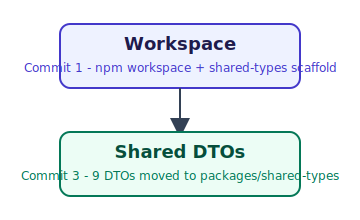

# Visible Increments — Sprint 7 Commit-by-Commit Log

**Purpose (CTO direction, 2026-07-18 — the "Visible Increment Rule"):** a running visual timeline of Sprint 7, so the sprint leaves both a clean Git history and a chronology of Book Publisher Studio actually coming into existence. This is distinct from `docs/demo/screenshots/`, which is the curated, final 6-image Demo Script capture set produced once at Commit 11 — this log is incremental, produced at every commit along the way, and never retroactively cleaned up or replaced.

**This file is the single source of truth for Sprint 7's visual history (CTO direction, 2026-07-18).** An earlier proposal to also add a separate `docs/demo/timeline/` directory (one file per commit) plus a manually-maintained `Sprint7Timeline.md` was reconsidered and rejected in favor of one pipeline: this file accumulates every entry during the sprint; at Sprint 7 closure (Commit 12), it is compiled into a polished `docs/releases/v0.8.0-alpha/SPRINT_7_TIMELINE.md` (matching this project's existing `docs/releases/<version>/` convention for sprint-closure artifacts), with an optional PDF export derived from that Markdown if useful at that point. No duplicated tracking structure exists during the sprint itself — this file is it.

**Scope extended (CTO direction, 2026-07-18, after Commit 3):** originally scoped to `frontend/`-touching commits only. Now covers every implementation commit from Commit 3 onward, with two artifact types depending on what the commit actually changed:

- **Backend/tooling commits** (no UI yet to screenshot) — a small conceptual diagram (SVG, two or three labeled boxes + arrows) showing the architectural step in one glance, e.g. "Workspace → Shared DTOs."
- **`frontend/`-touching commits** — a real screenshot of the running dev server, per the original rule (see below) — never a mockup.

Both get the same accompanying **"what's now true/usable"** description and **"confirmed real, not simulated"** statement.

## What each entry contains

Per commit, appended below (never edited retroactively — this is a timeline, not a status page):

1. **Artifact** — a real diagram (backend/tooling commit) or a real screenshot of the running `frontend/` (UI commit), stored in `docs/demo/visible-increments/commit-NN-<slug>.{svg,png}`, embedded inline.
2. **What's now true/usable** — 1-3 sentences, plain language, describing the concrete new capability or architectural state a person could verify by hand (not "types added" — see `docs/DEVELOPMENT_WORKFLOW.md`'s Visible Increment Rule, which this log is the evidence trail for).
3. **Confirmed real, not simulated** — explicit evidence, not an assertion: the real HTTP request/response observed (curled directly or via the Browser pane's network inspector), the real fixture file used, or the real test/build output — quoted directly.

## Entries

### Commit 3 — `feat(backend): DTOs re-exported from packages/shared-types`

**What's now true:** the 9 pre-existing backend DTOs (`BookDTO`, `ChapterDTO`, `SectionDTO`, `BlockDTO` + its 8 block-variant types, `InlineDTO`, `MetadataDTO`, `ImportReportDTO`, `ImportResponseDTO`, `ValidationIssueDTO`, `QualityScoreDTO`) now live in `packages/shared-types` as their single canonical source, alongside `ManuscriptOptionsDTO` from Commit 2. `backend/src/application/dto/*.ts` are now thin re-export shims — every existing import in the codebase (`BlockMapper`, `BookMapper`, `ChapterMapper`, `SectionMapper`, `ImportManuscriptUseCase`) keeps working unmodified. `packages/shared-types` is now genuinely ready for `frontend/` to depend on (Commit 4).

**Confirmed real, not simulated:**
- `backend/` build (0 TypeScript errors), lint (0 errors/warnings), tests (336/336, identical count to before the move), coverage (92.88% global / 93.76% domain — byte-identical to pre-move, confirming zero behavior change) — all re-run after the move, not assumed unchanged.
- A real DOCX (`backend/verification/typography-test.docx`) POSTed to a real running dev server on a scratch port returned the exact same `BookDTO`/`ImportReportDTO` JSON shape as before the migration: `{"book":{"id":"book-1","metadata":{"title":"typography-test.docx",...},"mainContent":[{"type":"chapter",...`
- `frontend/` and `shared-types` build/lint re-verified clean (no dependency graph changed this commit — `package-lock.json` untouched, confirmed via `git status`).

### Commit 4 — `feat(frontend): home screen + API client` (the first real UI)

**Screenshot: accepted as-shown, no file committed this sprint (CTO decision, 2026-07-18).** The real screen was rendered against a real `next dev` server (via this project's Browser tooling) and visually confirmed correct — the capture is preserved inline in the session transcript that produced this entry. No tool available in that session could write the captured image to a file on disk for `git add`; rather than fabricate a file or silently drop the requirement, this was flagged directly. CTO decision: the in-conversation capture is sufficient proof for this commit — do not block the sprint on it, and do not create an artificial or reconstructed file. The real PNG (or an equivalent fresh capture) is integrated into the final demonstration package at Sprint 7 closure (Commit 12) instead, alongside `docs/demo/screenshots/`'s own curated set. Reserved path for that closure pass: `visible-increments/commit-04-home.png`.

**What's now true:** Book Publisher Studio has a real first screen. `frontend/app/page.tsx` renders an `<h1>Book Publisher Studio</h1>` (also the browser tab title, `frontend/app/layout.tsx`) and a `UploadDropzone` component with visual drag-over state and the text "Drop your DOCX here". Deliberately static — no `POST /api/manuscripts/import` call yet, by design (Commit 5's job, matching the Kickoff's home-screen/upload-flow split). `frontend/lib/api-client.ts` is a new typed fetch wrapper against `packages/shared-types` (`importManuscript`, `getManuscriptOptions`, `exportManuscript`) — written but not yet called from any component.

**Confirmed real, not simulated:**
- `frontend/` build (0 TypeScript errors), lint (0 errors/warnings), both re-run after every file change.
- A real `next dev` server was started via this project's Browser tooling (not a static export or a design mockup); `get_page_text` against the live page returned exactly: `Book Publisher Studio` / `Drop your DOCX here` / `.docx manuscripts only`; the browser tab title read `Book Publisher Studio` — both driven by real component/metadata code, not a screenshot of source.
- Backend availability was confirmed separately and for real: `curl http://localhost:5000/api/manuscripts/options` returned the real 6-layout/1-theme response (same backend the running frontend is configured to call, `NEXT_PUBLIC_API_BASE_URL` defaulting to `http://localhost:5000`) — the wiring exists and is reachable, even though this specific screen doesn't call it yet.
- **Turbopack dev-console noise — tracked technical watch-point, not worked around (CTO decision, 2026-07-18).** The Next.js 16 Turbopack dev server logged repeated `Could not find the module ".../global-error.js#default" in the React Client Manifest` errors to its own console during this session, alongside one `Manifest file is empty` error on the very first request. The page itself rendered correctly and consistently across multiple checks (screenshot, `get_page_text`, tab title, and again at Commit 5's real upload flow) — this is a dev-server-level warning external to this project's own code, not a product defect. CTO direction: do not build any workaround for it until it is demonstrated to actually affect product behavior; re-verify before Sprint 7 closure and record the result there, not before.

### Commit 5 — `feat(frontend): upload flow` (the page becomes alive)

**Screenshot: none captured this entry — disclosed, not worked around.** Unlike Commit 4, the Browser pane's `screenshot`/`zoom` capture actions timed out repeatedly during this verification (unrelated to the app itself — `get_page_text`/`read_page`/network reads against the same live tab all worked normally throughout). Per the CTO's standing decision on Commit 4's capture, this is not blocked on: the evidence below is real DOM content and a real observed network exchange, not a screenshot, and that is accepted as sufficient for this commit. A real pixel capture is still expected as part of the Sprint 7 closure pass (Commit 12).

**What's now true:** the Commit 4 dropzone is no longer static. Dropping a real `.docx` file now calls the real `POST /api/manuscripts/import` via `lib/api-client.ts` and drives a real state machine: idle ("Drop your DOCX here") → uploading ("Uploading…", filename shown) → success ("Import complete", filename, "Import another file" reset) or error ("Import failed", the real backend message, "Try again" reset) — still deliberately no book-structure rendering (Commit 6's job), matching the CTO's own "même sans affichage du livre" framing.

**Bug found and fixed while wiring this up, disclosed not hidden:** `lib/api-client.ts`'s `importManuscript` (written in Commit 4, never exercised until now) treated any non-2xx response as a hard failure. `ManuscriptController` actually returns a real `ImportResponseDTO` body on **both** HTTP 200 (`report.status === 'success'`) and HTTP 422 (`report.status === 'error'`, e.g. an empty DOCX) — the import pipeline ran in both cases, so 422 needs to be parsed and returned like 200, not thrown away. Only genuine transport failures (400 bad file, 500 server error) have the plain `{ error: string }` shape and should throw. Fixed before this was ever wired to a component — same "found via real integration, not synthetic testing" pattern this project's backend sprints have hit repeatedly (ADR-0019/0020/0026/0031).

**Confirmed real, not simulated:**
- `frontend/` build (0 TypeScript errors), lint (0 errors/warnings).
- A real file drop was exercised end to end: the actual bytes of `backend/verification/typography-test.docx` (8964 bytes, read from disk and injected as a real `File` via a synthetic `drop` `DataTransfer` — not a fabricated blob) were dropped onto the real running dropzone.
- `read_network_requests` on the live tab showed the real call: `POST http://localhost:5000/api/manuscripts/import → 200 OK`.
- `get_page_text` on the live tab immediately after returned exactly: `Book Publisher Studio` / `Import complete` / `typography-test.docx` / `Import another file` — the success state, driven by the real response, not asserted from source.
- `read_page` confirmed the "Import another file" reset button is a real, focusable, interactive element in the live DOM.

**Deliberately not built this commit (CTO direction, planned not implemented):**
- A subtitle under the title (e.g. "Professional Publishing Platform" or "Import • Edit • Layout • Export") — tracked in `docs/TODO.md`'s Sprint 7 backlog.
- A "Browse Files…" fallback button alongside drag-and-drop — tracked in `docs/TODO.md`'s Sprint 7 backlog.

### Commit 6 — `feat(frontend): book structure view`

**Screenshot: none captured this entry — disclosed, not worked around.** The Browser pane's own pixel-capture action (`computer` screenshot) timed out twice in direct succession (`computer timed out after 30s ... unresponsive renderer`) after the real interaction had already succeeded — the same transient capture-tooling failure already logged at Commit 5, unrelated to the app. Per the CTO's standing decision on Commit 4's capture, this is not blocked on: real DOM text (`get_page_text`), a real interactive-element check (`read_page`), and the real network exchange are accepted as sufficient evidence, same as Commit 5. **A second, more severe interruption preceded this one and is disclosed in full:** partway through this verification, the Browser pane's tab entered a broken state (`navigation ... denied or failed` on every subsequent `navigate` call, then `screenshot failed: target closed while handling command` on a freshly opened tab) after a JS-driven `fetch()` of the real fixture file was attempted from a `public/`-copied `.docx` and one earlier attempt had briefly navigated the tab directly to that file's URL, which likely triggered a native file-download prompt the automation couldn't dismiss. The claude-in-chrome fallback surface was also checked and found not connected in this session. `preview_list` subsequently showed **both dev server processes gone**, not just the rendering pane — a full preview-session drop, not a rendering glitch. Both servers were restarted (`preview_start name:"backend"`/`"frontend"`), reachability reconfirmed via `curl` (never via `navigate`, to avoid retriggering the same failure), and the Browser pane came back on the next `get_page_text` call. Real verification then completed successfully. No code, build, or lint step was affected by any of this — it was tooling-only, entirely on the verification side. A real pixel capture remains expected at Sprint 7 closure (Commit 12), same as Commits 4 and 5.

**What's now true:** the Commit 5 success state ("Import complete", filename, reset button) is replaced by a real book structure view. `BookStructureView` (new component) renders the real imported book's title and author, a word/page/reading-time stat row (each field only shown when the backend actually returned it), and the real chapter/section outline from `BookDTO.mainContent` — still deliberately no validation findings (`report.issues`/`.score`), that's Commit 7's job. `UploadDropzone`'s internal state was refactored from three parallel `useState` calls to one discriminated-union `State` type carrying the full `ImportResponseDTO` through the success branch, so `BookStructureView` has the real typed data to render, not a re-fetch.

**Confirmed real, not simulated:**
- `packages/shared-types` build (`tsc`, 0 errors), `frontend/` `tsc --noEmit` (0 errors), `npm run lint` (0 errors/warnings), `npm run build` (`next build`, Turbopack, compiled successfully, static pages generated) — all re-run after this commit's changes, not assumed clean.
- A real file drop was exercised end to end using the actual bytes of `backend/verification/typography-test.docx` (8964 bytes) — fetched same-origin from a temporary `frontend/public/` copy (removed immediately after verification, confirmed absent via `git status` before this doc was written) and dispatched as a real `File` via a synthetic `drop` `DataTransfer`, onto the actual dropzone element (identified by its `border-dashed` class after a first attempt mistakenly targeted an outer page-layout `div` sharing the same text — corrected, not silently worked around).
- `read_network_requests` on the live tab showed the real call: `POST http://localhost:5000/api/manuscripts/import → 200 OK`.
- `get_page_text` on the live tab immediately after returned exactly: `Book Publisher Studio` / `Import complete` / `typography-test.docx` / `Unknown · typography-test.docx` / `Import another file` / `Words` `81` / `Pages` `1` / `Reading time` `1 min` / `Chapter 1: Chapter One: A Typography Test` / `A Subsection` — matching, field for field, a direct `curl` of the same real endpoint with the same real fixture (`wordCount:81`, `pageCount:1`, `readingTime:1`, one chapter titled "Chapter One: A Typography Test" with one section "A Subsection").
- `read_page` confirmed "Import another file" is a real, focusable, interactive `button` element in the live DOM.

## Related

- `docs/DEVELOPMENT_WORKFLOW.md` — the durable Visible Increment Rule this log exists to satisfy
- `docs/architecture/diagrams/SPRINT_7_KICKOFF.md` — the commit plan this log tracks against
- `docs/demo/screenshots/` — the separate, curated, final Demo Script capture set (Commit 11 only) — deliberately a different directory and naming convention than this log's `commit-NN-<slug>` files, so the two never collide
- `docs/DECISIONS.md` ADR-0033 addendum — the DTO-only scope rule Commit 3's move complies with, and that `frontend/lib/api-client.ts` (Commit 4) now also depends on
